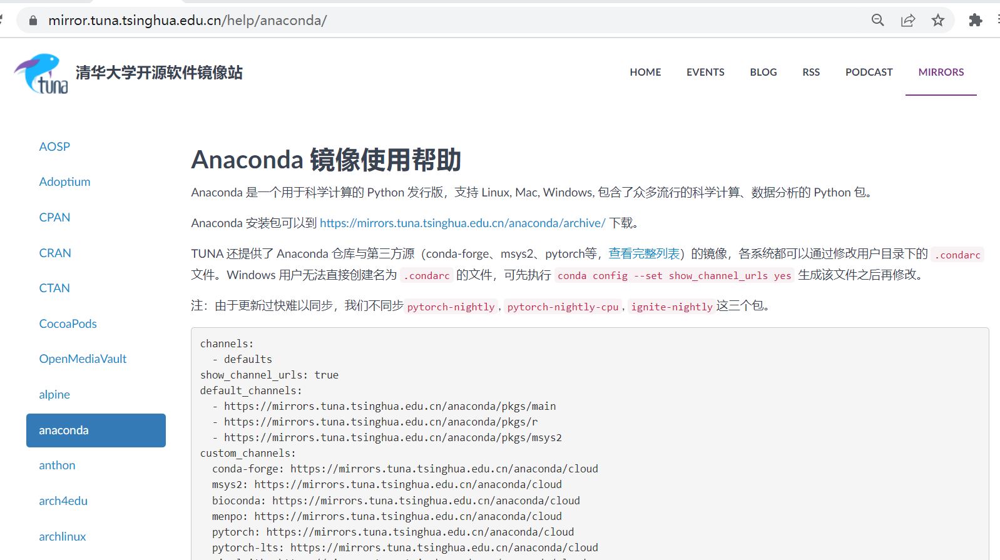

# Tutorial-on-configuring-a-deep-learning-environment-for-novices
配置深度学习环境教程-以配置Real-ESRGAN为例
<br>
<b>文档目录<b><br>
|-- Part 1开发环境搭建（硬件+软件）<br>
|------1.安装cuda<br>
|------2.安装Anaconda3<br>
|-- Part 2算法部署与运行<br>
|-------1.下载代码包<br>
|-------2.安装pytorch<br>
|-------3.安装requirements.txt其他依赖<br>
|-------4.运行<br>


----

# 深度学习--环境配置

<h4 align="right">zqy</h4>

---

<a style="color:red">注意: </a>（1）在Part 2部署运行环境的时候需要先cd到项目的根目录下，如`E:\Git-local`，然后再进行`conda env list`等操作<br>
（2）cmd不要用win+r打开，要在anaconda中打开


## Part 1 开发环境搭建（硬件+软件）

要有NVIDIA的显卡，因为AMD的无法安装CUDA;
NVIDIA显卡的配置最好GTX 980+,显存8G以上;
或者可以用平台提供的免费算力（用起来麻烦，但是偶尔跑个算法还是ok的）
### Step 1.安装cuda

> cuda是英伟达推出的运算平台
我们要根据显卡的型号来选择cuda的版本

如何查看电脑NVIDIA的版本：桌面右键打开NIVIDA控制面板，然后在系统信息中查看
笔者NVIDIA的版本是：<a style="color:red">511.79</a>


---

然后在英伟达的官网下载对应的cuda版本
英伟达官网：docs.nvidia.com/cuda/cuda-toolkit-release-notes/index.html


这里安装cuda 11.1.0,打开网址：developer.nvidia.com/cuda-11.1.0-download-archive
根据电脑的操作系统下载，得到exe文件

文件有点大，需要等待一下
下载后直接运行exe文件，一直点下去ok就行，一直安装...


检测cuda是否安装：打开cmd，输入nvcc -V,若出现cuda版本，则ok


安装完cuda后，可以在cmd中使用`nvidia-smi`指令查看显卡使用情况


至此，cuda安装完成

---

### Step 2.安装Anaconda 3
Anaconda是python的包管理器和环境管理器，安装包的版本根据电脑系统选择就ok
下载地址：https://www.anaconda.com/products/distribution

如果电脑下载很慢，也可以去清华大学开源软件镜像站下载
网址：https://mirrors.tuna.tsinghua.edu.cn/anaconda/archive/?C-M&O-D


下载后傻瓜式安装，一直点下去就ok

配置环境变量，在系统变量中添加anaconda的根目录和Scripts目录，
笔者目录如下:
* anaconda根目录：E:\ANACOND
* Scripts目录：E:\ANACONDA\Scripts


>Conda 简介：
Conda 是一个开源的软件包管理系统和环境管理系统，用于安装多个版本的软件包及其依赖关系，并在它们之间轻松切换。
Conda 是为 Python 程序创建的，适用于 Linux，OS X 和Windows，也可以打包和分发其他软件，是目前流行的Python环境管理工具


配置好后，在cmd中运行`conda env list`就能查看到我们的虚拟环境了


安装好后，我们需要先更换安装包的下载源
mirror.tuna.tsinghua.edu.cn/help/anaconda

conda默认使用的是国外的源地址，下载速度很慢
修改用户目录下的.condarc文件，添加如下内容并保存，这样就可以了,具体操作：
a.先运行`conda config --set show_channel_urls yes`
然后在用户目录下就会生成.condarc文件，以记事本格式打开，
添加以下内容并保存
注意：下面的用http,不要用https，不然会报错
```
channels:
  - defaults
show_channel_urls: true
default_channels:
  - http://mirrors.tuna.tsinghua.edu.cn/anaconda/pkgs/main
  - http://mirrors.tuna.tsinghua.edu.cn/anaconda/pkgs/r
  - http://mirrors.tuna.tsinghua.edu.cn/anaconda/pkgs/msys2
custom_channels:
  conda-forge: http://mirrors.tuna.tsinghua.edu.cn/anaconda/cloud
  msys2: http://mirrors.tuna.tsinghua.edu.cn/anaconda/cloud
  bioconda: http://mirrors.tuna.tsinghua.edu.cn/anaconda/cloud
  menpo: http://mirrors.tuna.tsinghua.edu.cn/anaconda/cloud
  pytorch: http://mirrors.tuna.tsinghua.edu.cn/anaconda/cloud
  pytorch-lts: http://mirrors.tuna.tsinghua.edu.cn/anaconda/cloud
  simpleitk: http://mirrors.tuna.tsinghua.edu.cn/anaconda/cloud
  ```

  然后创建一个新的环境，用于后续的算法环境的搭建，
输入指令`conda create -n zqy jupyter notebook cudnn`
cudnn是用于深度神经网络的GPU加速库，jupyter notebook是好用的交互式编辑器
> <b>cuDNN概述</b>
（1）NVIDIACUDA®深度神经网络库（cuDNN）是GPU加速的用于深度神经网络的原语库。cuDNN为标准例程提供了高度优化的实现，例如向前和向后卷积，池化，规范化和激活层。
（2）全球的深度学习研究人员和框架开发人员都依赖cuDNN来实现高性能GPU加速。它使他们可以专注于训练神经网络和开发软件应用程序，而不必花时间在底层GPU性能调整上。cuDNN的加快广泛使用的深度学习框架，包括Caffe2，Chainer，Keras，MATLAB，MxNet，PyTorch和TensorFlow。已将cuDNN集成到框架中的NVIDIA优化深度学习框架容器，访问NVIDIA GPU CLOUD了解更多信息并开始使用。
（3）cudnn加速框架


这里都会安装到新的虚拟环境中，然后点y,开始安装第三方依赖库第一次下载可能会很慢，慢慢等待


如果出现`Conda - Downloaded bytes did not match Content-Lengt`错误，参考以下文章：
https://blog.csdn.net/qq_46092061/article/details/119141556

如何手动安装cudnn
https://www.zhangshilong.cn/work/36621.html

conda下载超时怎么办：
https://blog.csdn.net/Arthur_Holmes/article/details/105095088

---
<a style="color:red">（可能要等好久）</a>第三方库安装完后，使用active指令切换到名为xxx的虚拟环境中，每个虚拟环境都是独立的，互不影响，这样子可以配置多个开发环境，避免冲突问题
Windows:` activate zqy`
Linux: `source activate zqy`


----

## Part 2.算法部署与运行
以超分辨率重建Ai算法为例
github：https://github.com/xinntao/Real-ESRGAN


### 1.算法环境搭建

#### Step 1. 下载代码包
在`https://github.com/xinntao/Real-ESRGAN`点击download下载
打开requirements.txt文件，里面详细说明了需要的第三方库
>facexlib>=0.2.0.3
gfpgan>=0.2.1
numpy
opencv-python
Pillow
torch>=1.7 （深度学习框架）
torchvision
tqdm

#### Step 2.安装pytorch
输入`conda env list`显示环境列表
输入`activate xxx` 切换到要安装的虚拟环境中


然后打开pytorch官网`https://pytorch.org/get-started/locally/`,根据我们的情况选择所需要的版本

然后复制命令`conda install pytorch torchvision torchaudio cudatoolkit=11.3 -c pytorch`安装pytorch
<a style="color:red">这里建议不要本地安装，不容易找bug</a>


#### Step 3.安装requirements.txt中的其他依赖
打开requirements.txt,将安装好的pytorch和torchvision删除掉


输入命令： `python -m pip install -r .\requirements.txt`
下载太慢的话用`pip install -r requirements.txt -i https://pypi.tuna.tsinghua.edu.cn/simple/ --default-timeout=5000`
速度会快很多,参照[换源+修改下载设置时间](https://www.csdn.net/tags/NtzaQgwsMjY1MDQtYmxvZwO0O0OO0O0O.html)


（注意，千万把VPN关掉，不然会报一堆错误）

[解决pip install -r requirements.txt很慢的方案](https://www.cnblogs.com/leafchen/p/13395677.html)


至此，算法依赖环境搭建完成


---


### 2.算法部署与运行

README_CN.md中记录了运行的方法

先下载好训练完成的模型`RealESRGAN_x4plus.pth`[地址](https://github.com/xinntao/Real-ESRGAN)

将模型放到工程目录的experiments/pretrained_models目录下


输入`python inference_realesrgan.py -n RealESRGAN_x4plus -i inputs --face_enhance`测试一下，结果会在results文件夹中
会出现以下错误

说明包导入有问题，看下本地目录，找到realesrgan文件夹，打开_init_.py文件
把`from.version import *`注释掉

等待下载其余资源后，即可以运行

在目录下会生成results文件夹

结果展示：将inputs和results文件夹图片对比如下


## 附录
[参考](https://blog.csdn.net/zyb1244151976/article/details/122751414)
Real-ESRGAN项目：https://github.com/xinntao/Real-ESRGAN

